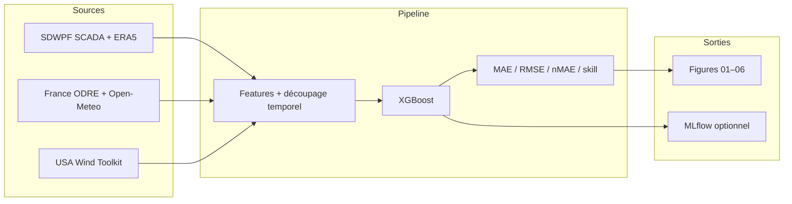

# Prévision de puissance éolienne — séries temporelles

[](https://www.python.org/downloads/)
[](LICENSE)
[](https://docs.pytest.org/)

Après la création du dépôt sur GitHub, tu peux ajouter un **badge CI** dans ce fichier (ligne Markdown prête à copier dans [`docs/PUBLICATION_GITHUB.md`](docs/PUBLICATION_GITHUB.md)).

Projet **Data Scientist** : données **France** (Open-Meteo, ODRE), **USA** (Wind Toolkit NLR), **Chine** (SDWPF SCADA + ERA5). Pipeline **XGBoost**, horizon **≥ 1 jour** (144 pas de 10 min), **split temporel** avec option **train / validation / test**, baseline **naive** (moyenne de la cible sur le train), suivi **MLflow** (extra optionnelle `experiments`), **Docker**.

**Documentation détaillée** : à lire en priorité **[`docs/GUIDE.md`](docs/GUIDE.md)** (parcours, glossaire, pièges, CLI).  
**Publier sur GitHub** : **[`docs/PUBLICATION_GITHUB.md`](docs/PUBLICATION_GITHUB.md)**.

---

## Sommaire

- [Aperçu & flux](#aperçu--flux)
- [Aperçu visuel (optionnel)](#aperçu-visuel-optionnel)
- [Structure du dépôt](#structure-du-dépôt)
- [Démarrage rapide](#démarrage-rapide)
- [Documentation](#documentation-complète)
- [Évaluation](#évaluation-rappel)
- [Secrets (NLR)](#secrets-nlr)
- [Conclusion](#conclusion-ce-que-jen-retiens)

---

## Aperçu & flux



---

## Aperçu visuel (optionnel)

Les PNG générés par `scripts/sdwpf_visualize.py` sont dans `reports/figures/` (tu peux en **committer** quelques-uns : voir `.gitignore`). Pour afficher des images **dans ce README**, copie-les dans `docs/assets/` (voir [`docs/assets/README.md`](docs/assets/README.md)) puis décommente ou adapte :

<!--
Prévision sur le jeu test (exemple) :


Tableau des métriques (exemple) :

-->

*Sans fichiers dans `docs/assets/`, cette section reste vide : le projet reste utilisable.*

---

## Structure du dépôt

```
├── README.md                 # Vous êtes ici
├── LICENSE                   # MIT
├── CONTRIBUTING.md           # Guide contributeur minimal
├── docs/
│   ├── GUIDE.md              # Parcours détaillé, glossaire, commandes, pièges
│   ├── PUBLICATION_GITHUB.md # git init, push, badges CI
│   ├── assets/               # Captures optionnelles pour le README
│   ├── DOMAINE_ET_PRATIQUES.md
│   ├── PLAN.md
│   └── INVENTAIRE_FICHIERS.md
├── .github/workflows/ci.yml  # Tests pytest (GitHub Actions)
├── src/sdwpf/                # Package Python (chargement, features, pipeline)
├── scripts/                  # Exécutables (voir ci-dessous)
├── tests/                    # pytest
├── data/                     # Données locales (souvent hors Git)
├── reports/                  # Benchmarks + reports/figures/*.png (selon .gitignore)
├── pyproject.toml
└── Dockerfile
```

**`scripts/`** :

| Script | Usage |
|--------|--------|
| `fetch_open_meteo_wind.py` | Télécharge la météo horaire Open-Meteo (France) |
| `download_wind_toolkit_nlr.py` | Télécharge Wind Toolkit (NLR / `.env`) |
| `sdwpf_explore.py` | Une turbine : métriques + importances |
| `sdwpf_benchmark.py` | Plusieurs horizons, CSV + Markdown |
| `sdwpf_visualize.py` | Figures PNG (série, nuage, test, importances, **KPI** `05_kpi_*`, **tableau métriques** `06_tableau_metriques_*`) |
| `clean_artifacts.py` | Supprime figures `*_h72_*`, dossier `mlruns/` ; option `--reports` |
| `sdwpf_walkforward.py` | Plusieurs plis test en fin de série (`--n-splits`, `--test-size`) ; moyenne / écart-type des MAE |

---

## Démarrage rapide

Depuis la **racine** du dépôt :

```bash
python -m venv .venv
# Windows: .venv\Scripts\activate
# Linux/macOS: source .venv/bin/activate
pip install -e ".[dev,experiments]"
```

Sans la dépendance **MLflow** (`pip install -e ".[dev]"` uniquement), les scripts tournent normalement ; `--mlflow` invite à installer l’extra `experiments`.

Données SDWPF lourdes : placer sous `data/china/sdwpf/` (détail dans [`docs/GUIDE.md`](docs/GUIDE.md)).

### Exemples SDWPF (même répertoire racine)

```bash
python scripts/sdwpf_explore.py --meteo-mode --horizon-hours 24
python scripts/sdwpf_explore.py --meteo-mode --train-frac 0.55 --val-frac 0.15
python scripts/sdwpf_benchmark.py --meteo-mode
python scripts/sdwpf_visualize.py --meteo-mode --horizon-days 1
python scripts/sdwpf_visualize.py --meteo-mode --horizon-days 1 --turb-ids 1,2,3,5,8
python scripts/sdwpf_walkforward.py --meteo-mode --horizon-days 1 --n-splits 3 --test-size 5000
```

### Données France / USA

**Limite France** : la production **ODRE** est un agrégat **national** ; la météo **Open-Meteo** est un **point** fixe. Ce n’est **pas** co-localisé : on ne peut pas l’utiliser comme un couple « turbine + météo au même site » (détail dans [`docs/GUIDE.md`](docs/GUIDE.md)).

**USA** : `download_wind_toolkit_nlr.py` exige un **`.env`** avec `NLR_API_KEY` et `NLR_EMAIL` (voir [Secrets](#secrets-nlr)).

```bash
python scripts/fetch_open_meteo_wind.py
python scripts/download_wind_toolkit_nlr.py
```

### XGBoost et GPU

Les scripts acceptent **`--xgb-device`** : **`auto`** (défaut si rien n’est passé : variable **`SDWPF_XGB_DEVICE`**, sinon auto) = essai **`hist` + `device=cuda`**, puis repli **CPU** ; **`cuda`** / **`cpu`** ; **`cuda:N`** pour l’ordinal GPU ([doc GPU](https://xgboost.readthedocs.io/en/stable/gpu/index.html), [installation](https://xgboost.readthedocs.io/en/stable/install.html)).

**Paquets** : **`pip install xgboost`** installe le wheel **complet** (algorithme GPU inclus sur **Windows x86_64** et **Linux**, selon le [guide officiel](https://xgboost.readthedocs.io/en/stable/install.html)). **`pip install xgboost-cpu`** = variante **CPU seulement** (plus légère). **Windows** : **Visual C++ Redistributable** souvent requis. **Conda** : `conda install -c conda-forge py-xgboost=*=cuda*` (GPU) ou `=*=cpu*` (CPU).

**Matériel / CUDA** : pilotes **NVIDIA** à jour ; **CUDA 12** et **compute capability ≥ 5.0** pour le GPU. Vérification : `python -c "import xgboost as xgb; print(xgb.build_info())"`.

### Tests

```bash
pytest -q
```

Les mêmes tests s’exécutent sur **GitHub Actions** (`.github/workflows/ci.yml`) pour Python **3.10** et **3.12**.

### Docker

```bash
docker build -t sdwpf-forecast .
docker run --rm -v "%CD%/data:/app/data" sdwpf-forecast python scripts/sdwpf_explore.py --help
```

---

## Documentation complète

| Fichier | Contenu |
|--------|---------|
| **[`docs/GUIDE.md`](docs/GUIDE.md)** | **Entrée principale** : intention, données, glossaire SCADA / ERA5, CLI, MLflow, `.env` |
| [`docs/PUBLICATION_GITHUB.md`](docs/PUBLICATION_GITHUB.md) | `git init`, remote, push, badge CI |
| [`docs/DOMAINE_ET_PRATIQUES.md`](docs/DOMAINE_ET_PRATIQUES.md) | Domaine, sous-domaines, checklist |
| [`docs/PLAN.md`](docs/PLAN.md) | Vision, roadmap, todo |
| [`CONTRIBUTING.md`](CONTRIBUTING.md) | Contribuer / tests |

---

## Évaluation (rappel)

- **Découpage temporel** : pas de mélange aléatoire ; option **`--val-frac`** pour **train | val | test** et early stopping XGBoost ; métriques **finales** sur le **test**.
- **Persistance** (`Patv(t)` → cible `Patv(t+h)`) : affichée **seulement** si `patv_now` est dans les features (sinon comparaison biaisée). **Naive** = moyenne de `y` sur le **train**, évaluée sur le **test**.

---

## Secrets (NLR)

Copier `.env.example` vers `.env` et renseigner `NLR_API_KEY` / `NLR_EMAIL` pour `scripts/download_wind_toolkit_nlr.py`.

---

## Conclusion (ce que j’en retiens)

**Performance prédictive (SDWPF, honnête)** : en **`--meteo-mode`** avec horizon **type J+1**, XGBoost **produit des prédictions cohérentes** (ordre de grandeur MAE / nMAE raisonnable, courbes test dans `03_*` qui suivent partiellement la vérité), mais sur un **parc large** (ex. 100 turbines) le **skill** vs la baseline **moyenne de la cible sur le train** est souvent **proche de zéro ou légèrement négatif** en MAE moyenne : le modèle n’est **pas** clairement supérieur à une référence très simple. C’est attendu tant que les seules entrées utiles sont **météo réanalysée + calendrier** sans puissance récente ni vent SCADA au pas série. Les figures **`05_*`** (résumé parc si beaucoup de turbines) et **`06_*`** (détail **par turbine** : MAE, nMAE, skill, bias) servent à **le montrer chiffré** plutôt que de prétendre à un gain miracle.

**Méthodo & objectif du dépôt** : **fil rouge** sur un cas éolien réel — **split temporel**, pas de fuite, **horizons longs** pour ne pas simuler une « inertie » à court terme via `Patv(t)` seul. Le mode **`--meteo-mode`** ne met dans les *features* que **calendrier (sin/cos)** + **ERA5**, pas le vent SCADA ni `Patv`. Les branches France / USA illustrent **des sources et leurs limites** (ex. prod nationale vs point météo non co-localisé). L’ambition n’est pas une solution miraculeuse mais un **pipeline explicable** et **honnête** pour un entretien ou un portfolio.
