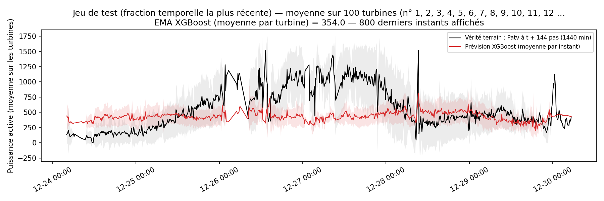

# Prévision de production éolienne (SDWPF)

[](https://github.com/Airohh/sdwpf-ml-time-serie/actions/workflows/ci.yml)
[](LICENSE)

Question : avec la météo réanalysée (ERA5) et le calendrier seulement, sans la puissance récente ni le vent mesuré par la turbine, peut-on prévoir la production d’une éolienne à J+1 ?

Données SDWPF (parc éolien chinois, SCADA toutes les 10 min + ERA5). Cible : `Patv` (kW) 144 pas plus tard, soit 24 h. Un XGBoost par turbine, split temporel 70 % train / 30 % test.

## Résultat

Réponse : non, pas mieux qu’une moyenne.

MAE sur le test, en kW. Naive = moyenne de `Patv` sur le train.

| Turbines | Naive | XGBoost | Écart |
|----------|-------|---------|-------|
| 1 | 434.1 | 530.6 | −22.2 % |
| 20 (n° 1–20) | 378.5 | 380.6 | −0.5 % |
| 100 (n° 1–100) | 346.2 | 354.0 | −2.2 % |

Sur 20 turbines, XGBoost bat la moyenne sur 13, mais ses pertes (jusqu’à −22 %) pèsent plus que ses gains (au plus +10 %).



La prévision reste entre 300 et 600 kW pendant que la production monte au-delà de 1 000 kW. Le modèle apprend le niveau moyen, pas les épisodes de vent.

Ce que j’en retiens :

- À J+1 et au pas de 10 min, la réanalyse ne porte pas assez d’information locale. Le gain viendrait de la puissance récente, du vent SCADA ou de vraies prévisions météo à l’échéance.
- La persistance (`Patv(t)` pour prédire `Patv(t+h)`) n’est pas affichée ici : ce serait comparer à une baseline qui a accès à une donnée que le modèle n’a pas.

Toutes les figures : `reports/figures/` (01 séries, 02 vent/puissance, 03 prévision, 04 importances, 05–06 métriques par turbine).

## Données

- **Chine (SDWPF)**, le cœur du projet. SCADA + ERA5, à placer sous `data/china/sdwpf/` (non versionné, trop lourd). Détail dans [`docs/GUIDE.md`](docs/GUIDE.md).
- **France** : production ODRE + météo Open-Meteo (`data/france/`). La production est nationale et la météo est prise en un point : pas de couple turbine + météo sur le même site.
- **USA** : Wind Toolkit (NLR). `scripts/download_wind_toolkit_nlr.py` demande `NLR_API_KEY` et `NLR_EMAIL` dans un `.env` (voir `.env.example`).

## Lancer

```bash
git clone https://github.com/Airohh/sdwpf-ml-time-serie.git
cd sdwpf-ml-time-serie
pip install -e ".[dev]"          # ".[dev,experiments]" pour MLflow

pytest -q
```

Avec les données SDWPF en place :

```bash
python scripts/reproduce_meteo_figures.py --preset multi20     # ou single, multi5, multi100
python scripts/sdwpf_explore.py --meteo-mode --horizon-days 1  # une turbine, métriques + importances
python scripts/sdwpf_benchmark.py --meteo-mode                 # plusieurs horizons, CSV + Markdown
python scripts/sdwpf_walkforward.py --meteo-mode --horizon-days 1 --n-splits 3 --test-size 5000
```

GPU : `--xgb-device cuda` (ou `auto`, `cpu`). Options et installation XGBoost GPU : [`docs/GUIDE.md`](docs/GUIDE.md).

Docker :

```bash
docker build -t sdwpf-forecast .
docker run --rm -v "$(pwd)/data:/app/data" sdwpf-forecast python scripts/sdwpf_explore.py --help
```

## Évaluation

- Split temporel, jamais aléatoire. `--val-frac` ajoute une validation (train | val | test) pour l’early stopping ; le score final est toujours sur le test.
- Naive : moyenne de la cible sur le train, évaluée sur le test.
- Persistance : calculée seulement si `patv_now` fait partie des features.
- Walk-forward : `scripts/sdwpf_walkforward.py`, moyenne et écart-type des MAE sur plusieurs plis en fin de série.

## Limites et suite

- Un seul parc et un seul découpage 70/30 pour les chiffres ci-dessus. `sdwpf_walkforward.py` sert à vérifier qu’ils tiennent sur d’autres fenêtres.
- ERA5 est une réanalyse, pas une prévision : en production, il faudrait la météo prévue à l’échéance.
- Suite : réintroduire le vent SCADA et la puissance récente là où c’est permis, puis passer à des prévisions en quantiles.

## Docs

- [`docs/GUIDE.md`](docs/GUIDE.md) : parcours complet, glossaire SCADA / ERA5, toutes les options CLI.
- [`docs/DOMAINE_ET_PRATIQUES.md`](docs/DOMAINE_ET_PRATIQUES.md) : domaine métier et checklist anti-fuite.

Licence [MIT](LICENSE).
